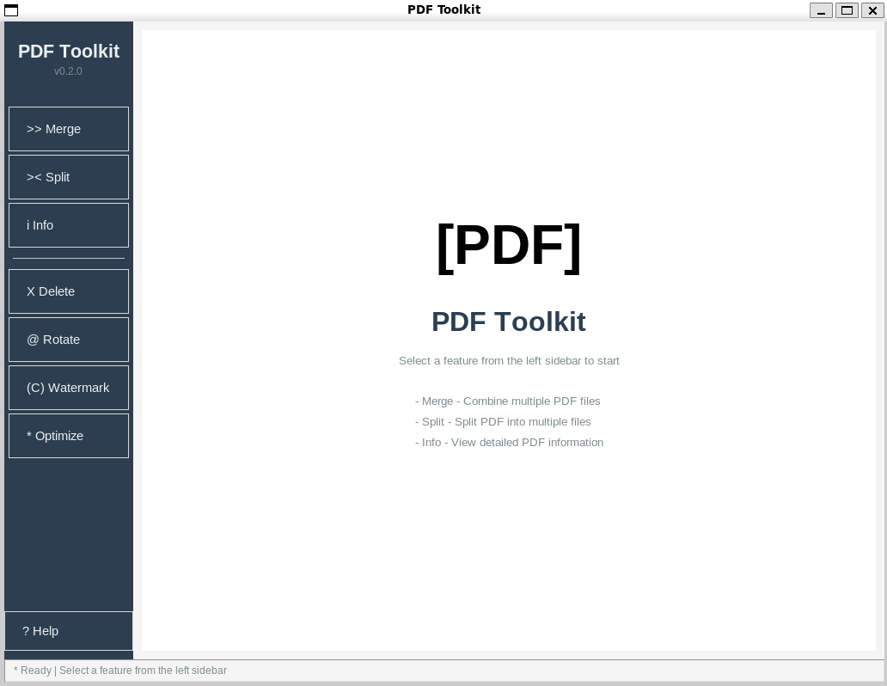

# PDF Toolkit

Basic PDF editing features — merge, split, delete, rotate etc.

## GUI Preview



## Features
- ✅ Merge multiple PDF files
- ✅ Split PDF (single pages or specified ranges)
- ✅ Delete specific pages (reverse deletion to avoid index misalignment)
- ✅ Rotate pages with cumulative angle support
- ✅ Add custom text watermarks to all pages
- ✅ Basic compression using pikepdf with linearization support
- ✅ Query PDF file information and metadata
- ✅ Graphical User Interface (GUI) for easy operation
- ✅ Autofill interactive PDF forms from JSON or inline data
- ✅ Extract text from PDF to text file
- ✅ Encrypt PDF with password protection (AES-256)
- ✅ Decrypt password-protected PDFs
- ✅ Extract images from PDF pages
- ✅ Convert PDF pages to image files (PNG/JPG)
- ✅ Reorder PDF pages in custom sequence
- ✅ Add page numbers with customizable positioning

## Installation

### Basic Installation (CLI only)
```bash
python -m venv .venv
source .venv/bin/activate  # Windows: .venv\Scripts\activate
pip install -r requirements.txt
```

### GUI Installation (Optional)
```bash
pip install -r requirements-gui.txt
```

## Usage

### Command Line Interface (CLI)

All commands are invoked via `python pdf_toolkit.py <subcommand> [...]`. Use `-h` or `--help` to view complete documentation.

#### Merge PDFs
```bash
python pdf_toolkit.py merge input1.pdf input2.pdf input3.pdf -o merged.pdf
```

#### Split PDF
```bash
# Split into single pages
python pdf_toolkit.py split input.pdf -d output_folder/

# Split by range
python pdf_toolkit.py split input.pdf -d output_folder/ -p "1-10,21-30"
```

#### Delete Pages
```bash
python pdf_toolkit.py delete input.pdf -p "1,3,5-8" -o trimmed.pdf
```

#### Rotate Pages
```bash
python pdf_toolkit.py rotate input.pdf -p "1-5" -a 90 -o rotated.pdf
```

#### Add Text Watermark
```bash
python pdf_toolkit.py watermark input.pdf -t "CONFIDENTIAL" -o watermarked.pdf

# Custom parameters
python pdf_toolkit.py watermark input.pdf -t "DRAFT" --size 48 --alpha 0.2 --angle 30 -o draft.pdf
```

#### Compress and Optimize
```bash
# Basic compression (with optional linearization)
python pdf_toolkit.py optimize input.pdf -o optimized.pdf --linearize

# Aggressive compression flag (currently falls back to basic compression with reminder)
python pdf_toolkit.py optimize input.pdf -o optimized_aggressive.pdf --aggressive --dpi 150
```

#### View PDF Information
```bash
python pdf_toolkit.py info input.pdf
```

#### Autofill PDF Form Fields
```bash
# Inspect available form fields
python pdf_toolkit.py autofill form.pdf --list-fields

# Fill fields using a JSON payload (keys must match field names)
python pdf_toolkit.py autofill form.pdf -d data.json -o filled.pdf

# Override / add individual values on the command line
python pdf_toolkit.py autofill form.pdf -d data.json -v employee_id=EMP-001 -o filled.pdf

# Fill and flatten the result into static text
python pdf_toolkit.py autofill form.pdf -d data.json -o filled_flat.pdf --flatten
```

#### Extract Text from PDF
```bash
# Extract text from all pages to console
python pdf_toolkit.py extract-text input.pdf

# Extract text to a file
python pdf_toolkit.py extract-text input.pdf -o output.txt

# Extract text from specific pages
python pdf_toolkit.py extract-text input.pdf -p "1-5,10" -o output.txt
```

#### Encrypt PDF
```bash
# Encrypt with user password
python pdf_toolkit.py encrypt input.pdf -o encrypted.pdf -u mypassword

# Encrypt with both user and owner passwords
python pdf_toolkit.py encrypt input.pdf -o encrypted.pdf -u userpass --owner-password ownerpass
```

#### Decrypt PDF
```bash
python pdf_toolkit.py decrypt encrypted.pdf -o decrypted.pdf -p mypassword
```

#### Extract Images from PDF
```bash
# Extract all images
python pdf_toolkit.py extract-images input.pdf -d output_images/

# Extract images from specific pages
python pdf_toolkit.py extract-images input.pdf -d output_images/ -p "1-3,5"
```

#### Convert PDF Pages to Images
```bash
# Convert all pages to PNG at 300 DPI
python pdf_toolkit.py pdf-to-images input.pdf -d output_images/

# Convert specific pages to JPG at custom DPI
python pdf_toolkit.py pdf-to-images input.pdf -d output_images/ -p "1-5" --dpi 150 --format jpg
```

#### Reorder PDF Pages
```bash
# Reorder pages in custom sequence
python pdf_toolkit.py reorder input.pdf -o reordered.pdf -p "3,1,2,4-6"

# Reverse page order (for a 5-page document)
python pdf_toolkit.py reorder input.pdf -o reversed.pdf -p "5,4,3,2,1"
```

#### Add Page Numbers
```bash
# Add page numbers at bottom-right (default)
python pdf_toolkit.py page-numbers input.pdf -o numbered.pdf

# Add page numbers at top-center with custom format
python pdf_toolkit.py page-numbers input.pdf -o numbered.pdf --position top-center --format "Page {page}"

# Customize size and offset
python pdf_toolkit.py page-numbers input.pdf -o numbered.pdf --size 12 --offset 30
```

### Graphical User Interface (GUI)

Launch the GUI application:
```bash
python pdf_toolkit_gui.py
```

The GUI provides an intuitive interface for all PDF operations:
- **Merge**: Combine multiple PDFs with drag-and-drop support
- **Split**: Split PDFs into individual pages or ranges
- **Info**: View detailed PDF metadata
- **Delete**: Remove specific pages
- **Rotate**: Rotate pages by 90, 180, or 270 degrees
- **Watermark**: Add customizable text watermarks
- **Optimize**: Compress PDFs with quality settings

## Page Number Syntax

- `1,3,5`: Individual pages
- `1-5`: Consecutive range
- `10-`: From page 10 to the end
- `1-3,5-7,10-`: Mixed usage

All page numbers are 1-based; the tool automatically removes duplicates and sorts them.

## Quick Validation (Optional)

The project includes `quick_test.py` for batch validation of all features (requires test PDFs):
```bash
python quick_test.py
```

## System Requirements

### Core Requirements
- Python 3.8+
- PyMuPDF (fitz)
- pikepdf
- Pillow
- tqdm

### GUI Requirements (Optional)
- tkinter (usually included with Python)


## Author

Taki HOR

## Contributing

Contributions are welcome! Please feel free to submit a Pull Request.


